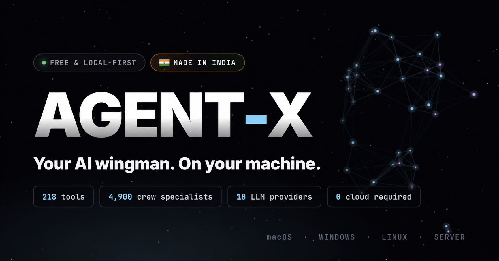

<p align="center">
  <a href="https://agentx.slashpan.com/">
    
  </a>
</p>

<p align="center">
  <strong>AGENT-X</strong> — a free, local-first autonomous AI agent for your machine.<br/>
  218 built-in tools · 4,900 crew specialists · 18 LLM providers · no cloud required
</p>

<p align="center">
  <a href="https://agentx.slashpan.com/">Website</a> ·
  <a href="https://github.com/SlashpanOrg/agent-x/releases/latest">Downloads</a> ·
  <a href="#install">Install</a> ·
  <a href="#server-cli">Server CLI</a> ·
  <a href="#repository">For developers</a>
</p>

---

## What is Agent-X?

Agent-X runs on your hardware with your API keys. Use it as a **desktop app** (macOS, Windows, Linux) or as a **headless server** with a browser-based Web UI — ideal for VPS, Docker, and remote machines.

- **Local-first** — sessions, memory, and config stay on your machine
- **Provider-agnostic** — OpenAI, Anthropic, Google, Ollama, LM Studio, and more
- **Tool-rich** — filesystem, shell, git, browser, Docker, MCP, and 200+ other capabilities
- **Crews** — delegate to thousands of pre-built specialist personas
- **No account** — no telemetry, no vendor lock-in

Full feature overview: [agentx.slashpan.com](https://agentx.slashpan.com/)

---

## Install

### Desktop app

Download the installer for your platform from **[Releases](https://github.com/SlashpanOrg/agent-x/releases/latest)**:

| Platform | Package |
|----------|---------|
| macOS (Apple Silicon) | `Agent-X-*-arm64.dmg` |
| macOS (Intel) | `Agent-X-*-x64.dmg` |
| Windows | `Agent-X Setup *.exe` |
| Linux | `.AppImage` or `.deb` |

**macOS (Apple Silicon) one-liner** — downloads the DMG and installs to `/Applications`:

```bash
curl -fsSL https://raw.githubusercontent.com/SlashpanOrg/agent-x/main/install-desktop.sh | bash
```

### Headless server (Web UI)

Requires **Node.js 20+**. Installs to `~/.agentx` and adds `agentx` to `~/.local/bin`.

**macOS / Linux:**

```bash
curl -fsSL https://raw.githubusercontent.com/SlashpanOrg/agent-x/main/install-server.sh | bash
export PATH="$HOME/.local/bin:$PATH"   # required when using curl | bash
agentx start
```

**Windows (PowerShell):**

```powershell
irm https://raw.githubusercontent.com/SlashpanOrg/agent-x/main/install.ps1 | iex
agentx start
```

Open the Web UI at **http://127.0.0.1:3333** (or `http://<server-ip>:3333` on a remote host).

> `install-server.sh` is a thin wrapper around `install.sh`. Both install the server package (`agentx-<platform>-server.tar.gz`).

---

## Server CLI

| Command | Description |
|---------|-------------|
| `agentx start` | Start the headless server and Web UI |
| `agentx status` | Check process and HTTP health |
| `agentx stop` | Stop the server |
| `agentx help` | Show usage |

**Paths**

| Item | Default |
|------|---------|
| Install dir | `~/.agentx` |
| CLI binary | `~/.local/bin/agentx` |
| Data / logs | `~/.local/share/agentx` |

**Environment variables**

| Variable | Description |
|----------|-------------|
| `AGENTX_VERSION` | Pin release tag (default: `latest`) |
| `AGENTX_INSTALL_DIR` | Override install directory |
| `AGENTX_BIN_DIR` | Override CLI symlink location |
| `AGENTX_PORT` | HTTP port (default: `3333`) |
| `AGENTX_HOST` | Bind address (default: `0.0.0.0` in server mode) |
| `AGENTX_PUBLIC_URL` | Public URL for OAuth redirects |

**Pin a version:**

```bash
AGENTX_VERSION=v0.8.7 curl -fsSL https://raw.githubusercontent.com/SlashpanOrg/agent-x/main/install.sh | bash
```

---

## Supported platforms

| | macOS | Linux | Windows |
|---|:---:|:---:|:---:|
| **Desktop app** | arm64, x64 | x64, arm64 | x64 |
| **Headless server** | arm64, x64 | x64, arm64 | x64 |

Server binaries: `agentx-<platform>-server.tar.gz` on the [Releases](https://github.com/SlashpanOrg/agent-x/releases/latest) page.

---

## Uninstall

**macOS / Linux:**

```bash
curl -fsSL https://raw.githubusercontent.com/SlashpanOrg/agent-x/main/uninstall.sh | bash
```

**Windows:**

```powershell
irm https://raw.githubusercontent.com/SlashpanOrg/agent-x/main/uninstall.ps1 | iex
```

---

## Repository

This is the **public distribution repo** for Agent-X. It is separate from the private application source tree.

| Location | Contents |
|----------|----------|
| `main` branch | Install scripts, landing page, docs |
| [GitHub Releases](https://github.com/SlashpanOrg/agent-x/releases) | Desktop installers and server tarballs (built by CI) |
| [agentx.slashpan.com](https://agentx.slashpan.com/) | Marketing site (`index.html` via GitHub Pages) |

**Files on `main`**

| File | Purpose |
|------|---------|
| `install.sh` | Server installer (macOS / Linux) |
| `install-server.sh` | One-liner alias → `install.sh` |
| `install-desktop.sh` | macOS Apple Silicon desktop installer |
| `install.ps1` | Windows server installer |
| `uninstall.sh` / `uninstall.ps1` | Remove server installation |
| `index.html` | Landing page (version and download links fetched from GitHub Releases) |
| `assets/` | Site images (`social_preview.png`, favicon) |

**Release flow (maintainers)**

1. Bump version in the private source repo and push to `main`.
2. CI builds desktop and server artifacts and publishes them to this repo’s GitHub Releases.
3. Install scripts on `main` are served via `raw.githubusercontent.com` — update them here when installer behaviour changes.
4. The landing page pulls the latest tag and asset URLs from the GitHub API at runtime.

---

<p align="center">
  <sub>Made in India · <a href="https://slashpan.com">Slashpan Technologies</a></sub>
</p>
